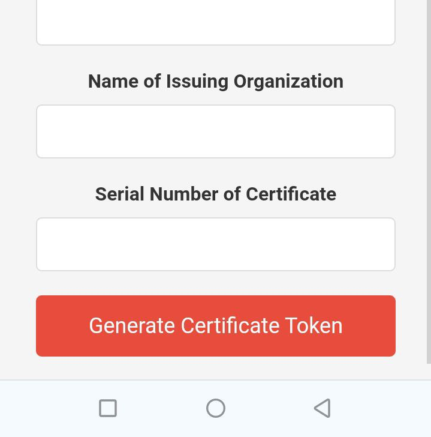

# Project Name

## Overview
End-to-End Web 3.0 decentralized application for authentication and secure Certification issuing for trainees. we will demonstrate state-of-the-art of Blockchain technologies to secure and authenticate the certification process by adapting the most secured and autonomous system. Blockchain enable decentralization of internet as well as it leveraged users to have a complete ownership over public assets. We will use NFTs to represent actual asset in real world which in our case is A Certificate, certificate must hold its uniqueness to not be able replicated by any party. once the tokens are created in the blockchain they will have certain public address alongside the NFT. 

## Features

the key features of the project:

1. **Strong Authentication:**
   
2. **NFTs for Uniqueness of the each certificates:**
   
3. **Complete Ownership no third party for security or database:**
   
4. **Autonomous self-executed System:**

## Technologies Used

List the technologies and tools used in the project:

- Blockchain (Algorand blockchain)
- Algorand Sandbox (local access of algorand network node)
- NFTs (Non-Fungible Tokens)
- Smart Contracts

## Getting Started

### install python frameworks using the following commands on terminal:
```bash
$ pip install requirements.txt
```
### install frame work from Node Package Manager
```bash
$ cd front-end
$ npm install
```
### Sandbox installation

To install the sandbox, please refer to the [sandbox README](./sandbox/README.md).

###

step-by-step instructions for setting up the project locally:

1. Clone the repository: `https://github.com/DanielZerihunGeda/End-to-End-Web3-dApp`
2. Change directory: `cd sandbox`
3. start sandbox: ./sandbox up
4. set up .env file inside project folder: 
```bash
	OPENAI_API_KEY='your_openai_api_key'
	CREATOR_PRIVATE_KEY="Creator_private_key"
	CREATOR_PUBLIC_KEY="creator public addres"
	ALGOD_TOKEN="Algorand Api token"
	ALGOD_ADDRESS="http://localhost:4001"
	CREATOR_MNEMONIC="your_mnemonic_key"
```
5. go to front-end directory: `cd front-end`

6. Run the frontend application: `npm start`

## Usage

Insert Datas in the given field to create dedicated token for each certificates
after inserting successfull insertion hit `Generate Certificate token`

 

After fully insert all necessary information by hitting `Generate Certificate Token` the NFTs can be created.
For security and certral access store all credentials and hosting addresses inside your .env file

### Back-end
The back-end have two layers of api post call.
	1. the first layer of call is initiated by `Algorand_Back-end.py` module.
	2. the second call will be automatically intiated by `POST_request_to_algorand.py` to post call our NFTs creator module `Algorand_Back-end.py`
## Contributing


## License

[License](./LICENSE)

## Acknowledgments

10 Academy Team for guiding through-out the project.

## Contact


